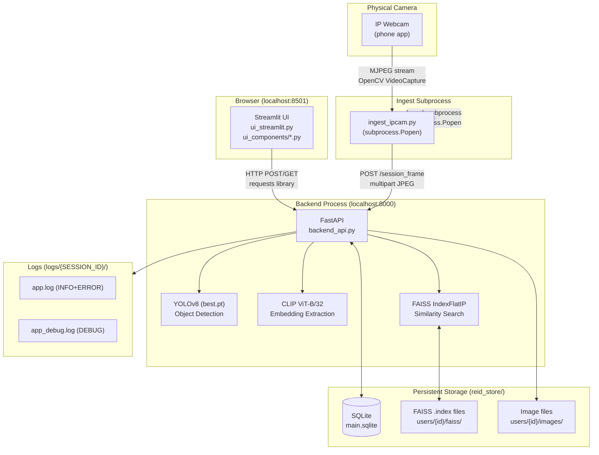
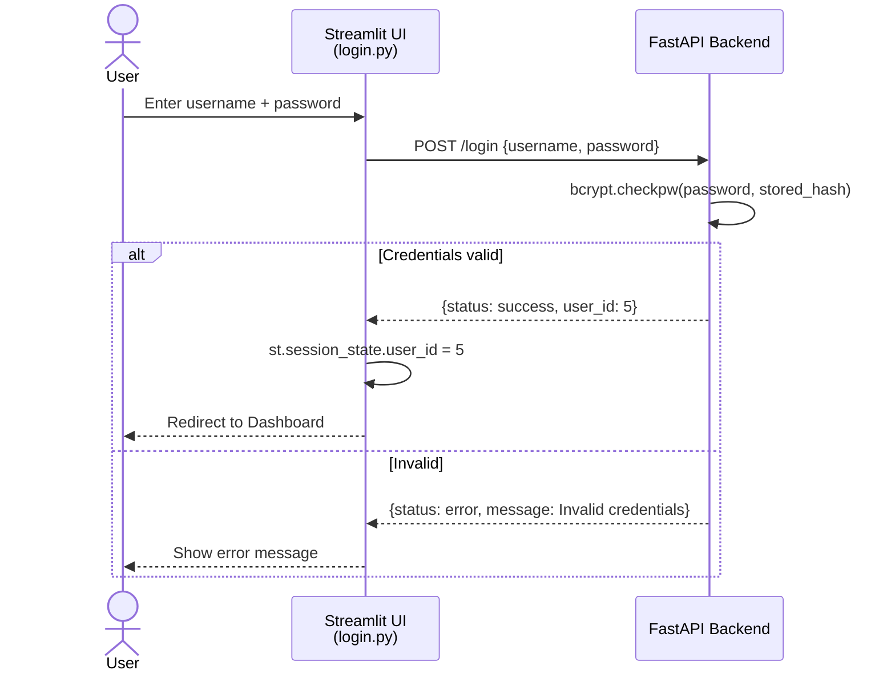
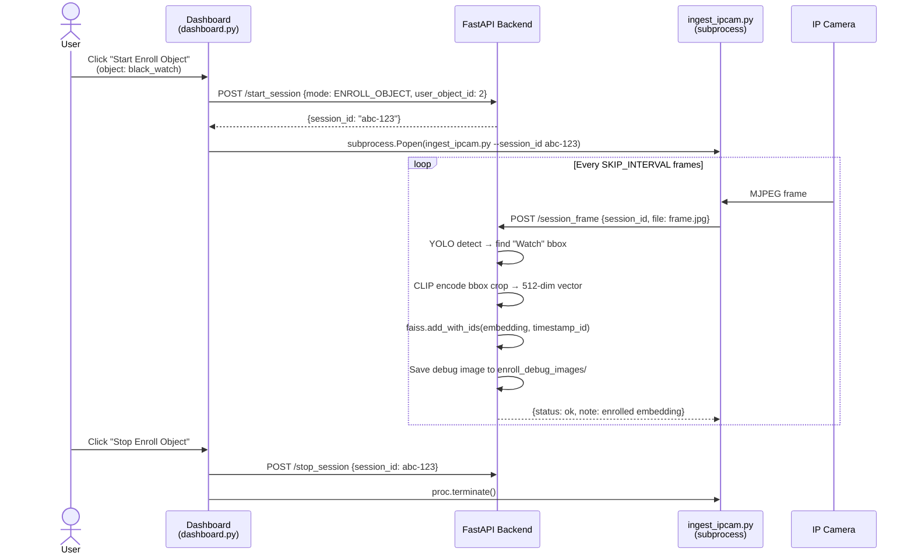
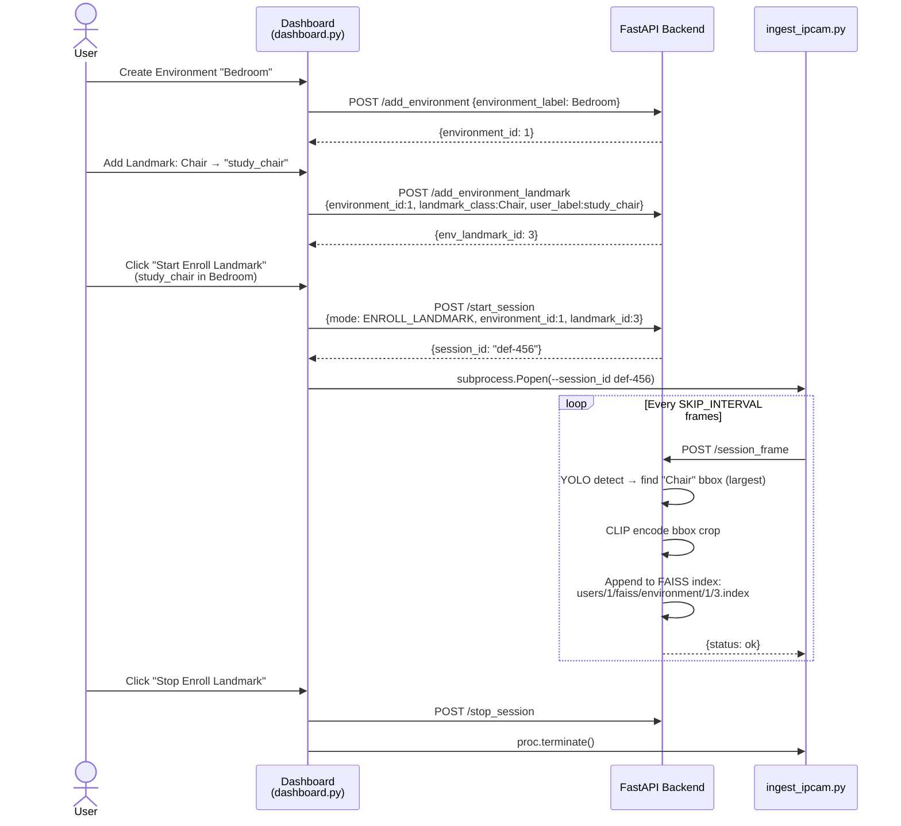
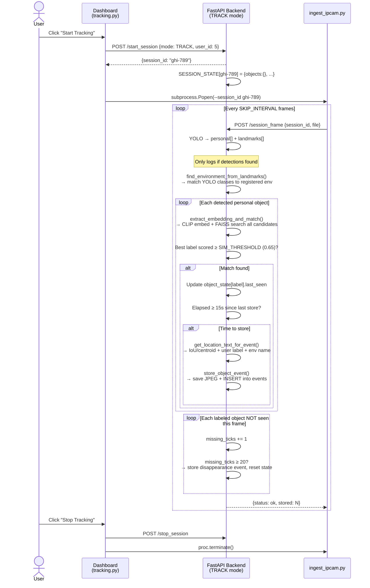
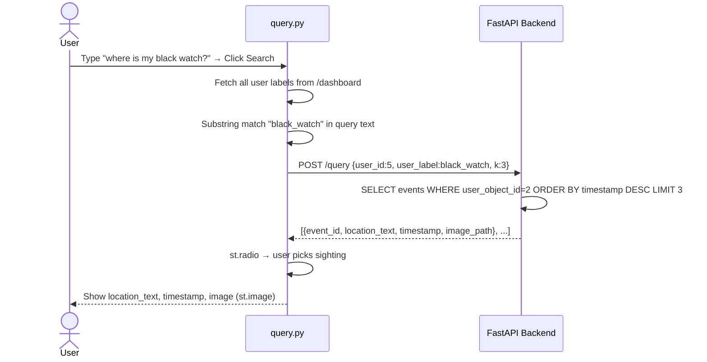

# Architecture Overview — Vision Memory Assistant

---

## 1. High-Level Description

The system has **three processes** running simultaneously, plus persistent storage:

| Process | File | Role |
|---|---|---|
| **Backend API** | `backend_api.py` | All ML logic, DB access, FAISS operations. Exposes REST API on port 8000. |
| **Streamlit UI** | `ui_streamlit.py` + `ui_components/` | Web-based frontend. Routes pages, shows controls, calls backend via HTTP. |
| **Camera Ingest** | `ingest_ipcam.py` | Subprocess launched by UI. Reads IP camera frames and POSTs them to `/session_frame`. |

Storage layers:
- **SQLite** (`reid_store/main.sqlite`) — users, objects, environments, events, sessions
- **FAISS indices** (`reid_store/users/{id}/faiss/`) — CLIP embedding vectors
- **Image files** (`reid_store/users/{id}/images/`) — saved detection frames
- **Log files** (`logs/{SESSION_ID}/app.log` + `app_debug.log`) — runtime and debug logs

---

## 2. Component Diagram



---

## 3. Sequence Diagrams

### 3a. Login / Register Flow



### 3b. Enroll Object Flow



### 3c. Enroll Environment (Landmark) Flow



### 3d. Tracking + Event Storage Flow



### 3e. Query + Result Rendering Flow



---

## 4. Why Three Separate Processes?

Two main reasons:

**1. Streamlit reruns everything on each interaction.**
Every button click causes Streamlit to re-execute `ui_streamlit.py` top to bottom. If the
camera capture loop ran inside Streamlit, it would be killed and restarted on every click.
By putting it in a subprocess (`ingest_ipcam.py`), the camera loop runs independently and
continuously, unaffected by UI reruns.

**2. Heavy ML models can't live in a browser-facing process.**
YOLO and CLIP take several seconds to load. They are loaded **once** when `backend_api.py`
starts (`backend_api.py` lines 56–61) and stay in memory. If they loaded in the UI, every
page navigation would re-load them. FastAPI keeps them alive and serves any number of requests.

**How they communicate:**
- UI → Backend: synchronous HTTP (POST/GET via `requests` library, `ui_components/utils.py`)
- Ingest → Backend: HTTP multipart POST for each frame (`/session_frame`)
- UI → Ingest: OS process control (`subprocess.Popen`, `proc.terminate()`)

---

## 5. Additional Info — What Is a Session and Why?

### The Problem It Solves

When you click **Start Tracking**, the camera starts sending frames. But Streamlit is a web app —
it doesn't keep a "connection" open between you and the server. Every button click is a separate
HTTP request. So how does the backend know "this frame belongs to *this* user in *this* mode"?
That's exactly what a **session** solves.

### What a Session Is

A session is a **unique ID** (a UUID like `"abc-def-123-456"`) that acts like a
"ticket" tying everything together. When you click Start Tracking:

```
UI sends: POST /start_session {user_id: 5, mode: TRACK}
Backend creates: session_id = "abc-def-123-456"
                  → Saved in SQLite sessions table (status=RUNNING)
                  → Saved in SESSION_STATE dict (live tracking data in memory)
Backend returns: {session_id: "abc-def-123-456"}
UI stores it:    st.session_state.session_id = "abc-def-123-456"
```

The ingest subprocess is then launched with `--session_id abc-def-123-456`. Every frame it sends
carries that ID:
```
POST /session_frame {session_id: "abc-def-123-456", file: frame.jpg}
```

The backend looks up the session, finds `user_id=5, mode=TRACK, status=RUNNING`, and processes
the frame accordingly.

### What Happens Without Sessions

Without sessions you'd need to somehow keep track of "who is tracking right now" and "what mode
are they in" using some other mechanism — like a single global dict keyed by user_id. But then:
- Two users can't track simultaneously (they'd overwrite each other's state)
- You can't distinguish "this user is enrolling object #2" from "this user is tracking"
- If the backend restarts, you lose all context; with sessions in SQLite, you can query the
  DB to find all sessions that were `RUNNING` and clean them up

### Why There Are Two Stores (SQLite + SESSION_STATE dict)

| Store | What | Why |
|---|---|---|
| `sessions` table (SQLite) | session_id, user_id, mode, status, timestamps | Persists across backend restarts. UI can always check session status with `GET /session_status`. |
| `SESSION_STATE` dict (in-memory) | Live tracking data: per-object last_seen, last_frame, last_bbox, missing_ticks | Changes every single frame — too fast for DB writes. Cleared when session stops. |

### Session Lifecycle

```
/start_session → status = RUNNING (DB) + live dict created (memory)
                           ↓
            frames arrive → SESSION_STATE updated per frame
                           ↓
/stop_session  → status = STOPPED (DB) + live dict deleted (memory)
```

If the camera disconnects unexpectedly (`ingest_ipcam.py` line 63–69), the ingest script calls
`/stop_session` automatically before exiting, so the session is cleanly closed.
