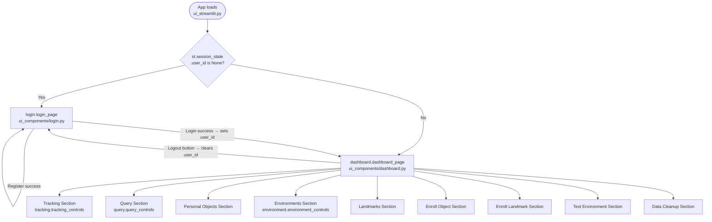

# UI Flow and Buttons — `ui_streamlit.py` + `ui_components/`

---

## Navigation Overview

---

## Session State Variables

These are the key `st.session_state` keys used across the UI:

| Key | Set By | Meaning |
|---|---|---|
| `user_id` | `login.py` on login success | Currently logged in user. `None` = not logged in. |
| `username` | `dashboard.py` on first load | Cached display name |
| `session_id` | Any "Start *" button | UUID of the active backend session |
| `mode` | Any "Start *" button | Current mode: `TRACK`, `ENROLL_OBJECT`, etc. |
| `ingest_proc` | `tracking.launch_ingest()` | `subprocess.Popen` handle for `ingest_ipcam.py` |
| `selected_environment` | Tracking section (optional) | Environment to pass to `/start_session` |
| `query_input` | Query text input widget / Voice button | Text in the query box |
| `last_data` | Search button in query | Last API response from `/query` |
| `last_obj` | Search button in query | Label that was searched |

---

## Page: Login (`ui_components/login.py`)

**Function:** `login_page()` (line 15)

### Tab: Login
| Element | Action | Backend Call | State Change | User Sees |
|---|---|---|---|---|
| Username text input | Type credentials | — | `login_u` key | — |
| Password text input | Type credentials | — | `login_p` key | — |
| **Login** button | Submit | `POST /login {username, password}` | `st.session_state.user_id = res["user_id"]` | Dashboard |

On failure: `st.error("❌ Invalid credentials")`

### Tab: Register
| Element | Action | Backend Call | State Change | User Sees |
|---|---|---|---|---|
| New username / password inputs | Fill form | — | — | — |
| **Register** button | Submit | `POST /register_user {username, password}` | None (must then login) | Success notice + hint to login |

Client-side validation: password length < 4 → error shown before any API call.

---

## Page: Dashboard (`ui_components/dashboard.py`)

**Function:** `dashboard_page()` (line 9)

On load, calls:
- `GET /get_user_info?user_id=5` (once, cached in `st.session_state.username`)
- `GET /dashboard?user_id=5` (every render) → populates `objects[]` and `envs[]`

---

### Top Bar

| Element | Action | Backend Call | State Change | User Sees |
|---|---|---|---|---|
| IP Camera URL text input | Edit camera URL | — | Local `ip_cam_url` variable | — |
| **Logout** button | Stop camera + clear session | `tracking.stop_ingest_if_running()` (no backend call) | `user_id=None`, `session_id=None`, `mode=None` | Login page |

---

### Section: Tracking (`ui_components/tracking.py → tracking_controls()`)

| Button | Backend Call | Payload | State Change | User Sees |
|---|---|---|---|---|
| **Start Tracking** | `POST /start_session` | `{user_id, mode:"TRACK"}` (+ `environment_id` if `selected_environment` set) | `session_id=<uuid>`, `mode="TRACK"`, `ingest_proc=<subprocess>` | "Tracking started." Camera preview window opens on desktop |
| **Stop Tracking** | `POST /stop_session` | `{session_id}` | `session_id=None`, `mode=None`, `ingest_proc=None` (proc terminated) | "Stopped." |

---

### Section: Query (`ui_components/query.py → query_controls()`)

| Element | Action | Backend Call | State Change | User Sees |
|---|---|---|---|---|
| **Voice Input** button | Record 5s audio → Google Web Speech → transcription | External: Google Web Speech API | `st.session_state["query_input"] = transcribed_text` + `st.rerun()` | Spinner "Listening..." → text box populated |
| Query text input | Type query | — | `st.session_state["query_input"]` | — |
| Number of results selectbox | Choose 1–10 | — | Local `k` variable | — |
| **Search** button | Parse label from text → API call | `POST /query {user_id, user_label, k}` | `last_data`, `last_obj` in session_state | Results list (radio) + image |

**Label parsing logic (`query.py` lines 91–106):**
1. Fetch all registered object labels for this user
2. Iterate labels; check if `label.lower()` is a substring of `query_text.lower()`
3. If no match: keyword fallback — `"watch"` → `"Watch"`, `"wallet"` → `"Wallet"`, `"key"` → `"Bike Key"`
4. If still no match: show error

**Results display (`show_results()`):**
- `st.radio` to pick which sighting to view
- Shows: `utils.ordinal(i)` (e.g. "Last seen"), `utils.pretty_time(timestamp)`, `location_text`, image via `st.image(path)`

---

### Section: Personal Objects (`dashboard.py` lines 55–125)

| Element | Action | Backend Call | Payload | User Sees |
|---|---|---|---|---|
| Object list | Display only | — | — | `[Watch] black_watch` |
| **Delete** button (per object) | Delete object + events + FAISS | `POST /delete_personal_object` | `{user_id, user_object_id}` | "Deleted" + page rerun |
| Object type selectbox | Pick YOLO class | — | `PERSONAL_CLASSES` from constants | Dropdown |
| Your label text input | Enter label | — | — | — |
| **Create Object** button | Create + empty FAISS | `POST /add_personal_object` | `{user_id, generic_type, user_label}` | `object_id` shown, page rerun |

---

### Section: Enroll Object (`dashboard.py` lines 82–126)

| Button | Backend Call | Payload | State Change | User Sees |
|---|---|---|---|---|
| **Start Enroll Object** | `POST /start_session` | `{user_id, mode:"ENROLL_OBJECT", user_object_id}` | `session_id`, `mode="ENROLL_OBJECT"`, `ingest_proc` | "Enrolling... show object to camera." Camera window opens |
| **Stop Enroll Object** | `POST /stop_session` | `{session_id}` | `session_id=None`, `mode=None` | "Enroll stopped." |

---

### Section: Environments (`ui_components/environment.py → environment_controls()`)

| Element | Action | Backend Call | Payload | User Sees |
|---|---|---|---|---|
| Environment name input | Type name | — | — | — |
| **Create Environment** button | Create room | `POST /add_environment` | `{user_id, environment_label}` | "Created environment." + rerun |
| **Delete** button (per env) | Delete env + landmarks | `POST /delete_environment` | `{user_id, environment_id}` | "Deleted" + rerun |

---

### Section: Landmarks (`dashboard.py` lines 136–220)

| Element | Action | Backend Call | Payload | User Sees |
|---|---|---|---|---|
| Environment selectbox | Pick env | `GET /get_environment_landmarks` | `{user_id, environment_id}` | List of existing landmarks |
| **Delete** (per landmark) | Remove landmark | `POST /delete_environment_landmark` | `{user_id, environment_id, user_label}` | "Deleted" + rerun |
| YOLO class selectbox | Pick from `LANDMARK_CLASSES` | — | — | Dropdown |
| Your Label input | Custom name | — | — | — |
| **Add Landmark** button | Register landmark def | `POST /add_environment_landmark` | `{user_id, environment_id, landmark_class, user_label}` | "Added 'X' to Bedroom" + rerun |

---

### Section: Enroll Landmark (`dashboard.py` lines 223–275)

| Button | Backend Call | Payload | State Change | User Sees |
|---|---|---|---|---|
| **Start Enroll Landmark** | `POST /start_session` | `{user_id, mode:"ENROLL_LANDMARK", environment_id, landmark_id}` | `session_id`, `mode="ENROLL_LANDMARK"`, `ingest_proc` | "Enrolling landmark..." Camera window |
| **Stop Enroll Landmark** | `POST /stop_session` | `{session_id}` | `session_id=None`, `mode=None` | "Landmark enrollment stopped." |

---

### Section: Test Environment (`dashboard.py` lines 278–315)

| Button | Backend Call | Payload | State Change | User Sees |
|---|---|---|---|---|
| **Start Test Environment** | `POST /start_session` | `{user_id, mode:"TEST_ENVIRONMENT", environment_id}` | `session_id`, `mode="TEST_ENVIRONMENT"`, `ingest_proc` | "Testing environment..." Camera preview window shows annotated bounding boxes |
| **Stop Test Environment** | `POST /stop_session` | `{session_id}` | `session_id=None`, `mode=None` | "Test stopped." |

> In TEST_ENVIRONMENT mode, the backend annotates each frame with cyan boxes (landmarks) and green boxes (personal objects) and returns the annotated JPEG as base64. `ingest_ipcam.py` (line 93–99) decodes and displays it in the OpenCV preview window.

---

### Section: Data Cleanup (`dashboard.py` lines 320–339)

| Element | Action | Backend Call | Payload | User Sees |
|---|---|---|---|---|
| Time period selectbox | Pick from `CLEANUP_OPTIONS_HOURS` | — | — | Options: "1 Hour", "2 Hours", …, "2 Days" |
| **Run Cleanup** button | Delete old events | `POST /manual_cleanup` | `{user_id, older_than_minutes}` | "Deleted N events older than X" |

---

## Helper Functions

### `ui_components/utils.py`

| Function | Purpose |
|---|---|
| `api_post(path, data)` | POST to backend with timeout=15s. Handles HTTP errors + JSON decode errors, always returns dict |
| `api_get(path, params)` | GET from backend with timeout=15s. Same error handling |
| `pretty_time(iso_str)` | Convert ISO timestamp → `"02 Mar 2026 • 02:35 PM"` |
| `ordinal(i)` | Return `"Last seen"`, `"Second most recent"`, … |

### `ui_components/tracking.py`

| Function | Purpose |
|---|---|
| `stop_ingest_if_running()` | `proc.terminate()` if `ingest_proc` is in session state |
| `launch_ingest(session_id, ip_cam_url, fps)` | `subprocess.Popen(["python", "ingest_ipcam.py", ...])` |
| `tracking_controls(uid, ip_cam_url, fps)` | Renders Start/Stop Tracking buttons |
